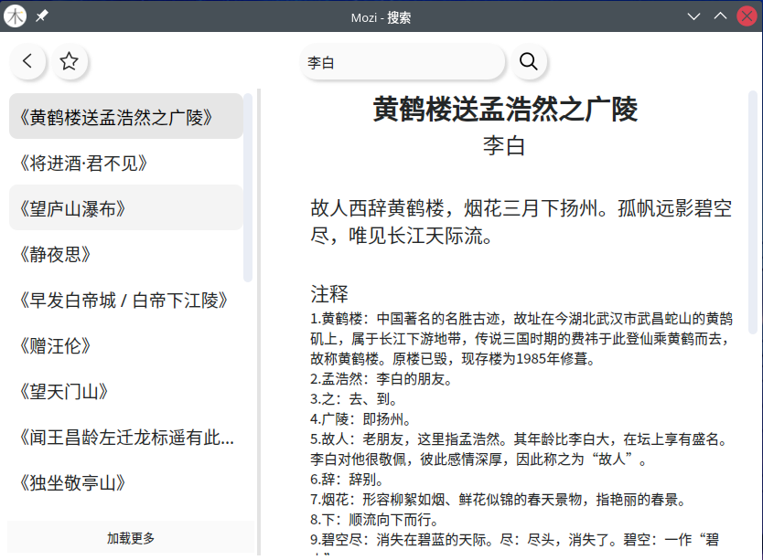
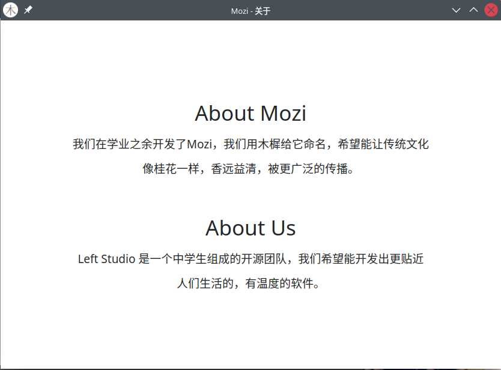

# Mozi


## 项目介绍
* Mozi是一个基于 `Qt5` 开发的跨平台桌面诗词软件，我们在学业之余开发了Mozi。
* 我们用木樨给它命名，希望能让传统文化像桂花一样，香远益清，被更广泛的传播。
## 编译 / 使用
* 开发环境：`Qt 5.15.2` （Linux） `Qt 5.15.2`（Windows）
* 编译
  ```shell
  git clone https://github.com/LeftStudio/mozi.git
       # or https://gitee.com/left-studio/mozi.git
  cd mozi
  mkdir build
  cd build
  qmake ..
  make -j
  ```
* 目前只有 `Win32` 二进制程序安装包，Linux 暂时无法打包。:confused:（如果有会的大佬可以联系我们 :stuck_out_tongue_winking_eye:）
## 运行效果





## 关于我们
* Left Studio 是一个中学生组成的开源团队，我们希望能开发出更贴近人们生活的，有温度的软件。
* 项目负责人：qygw（QQ：852348063）